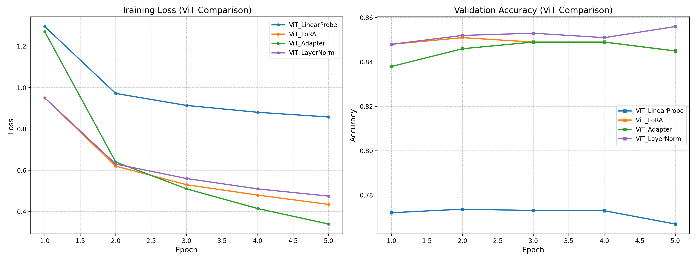
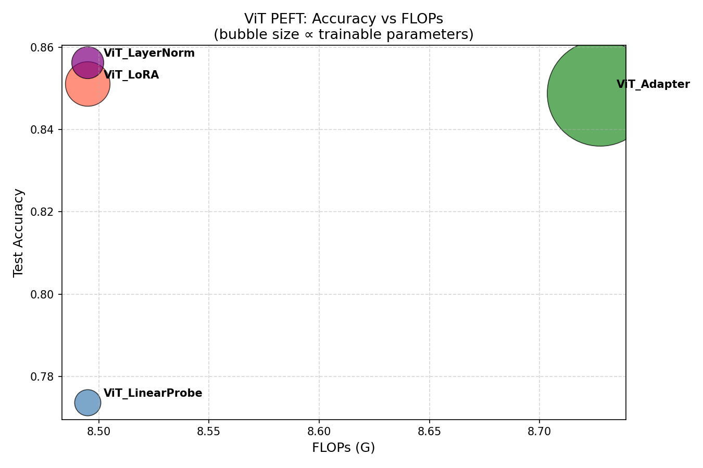
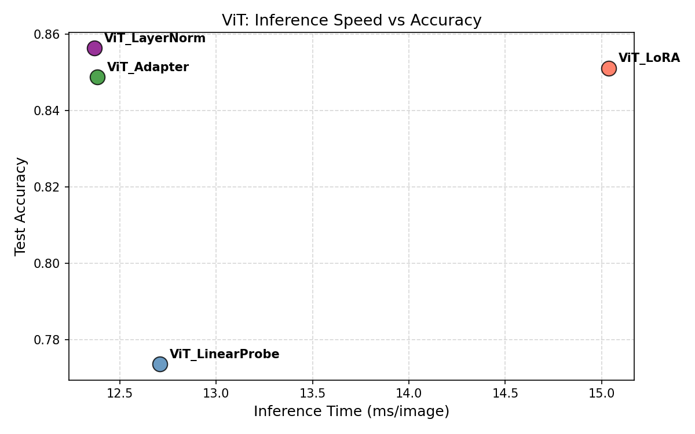
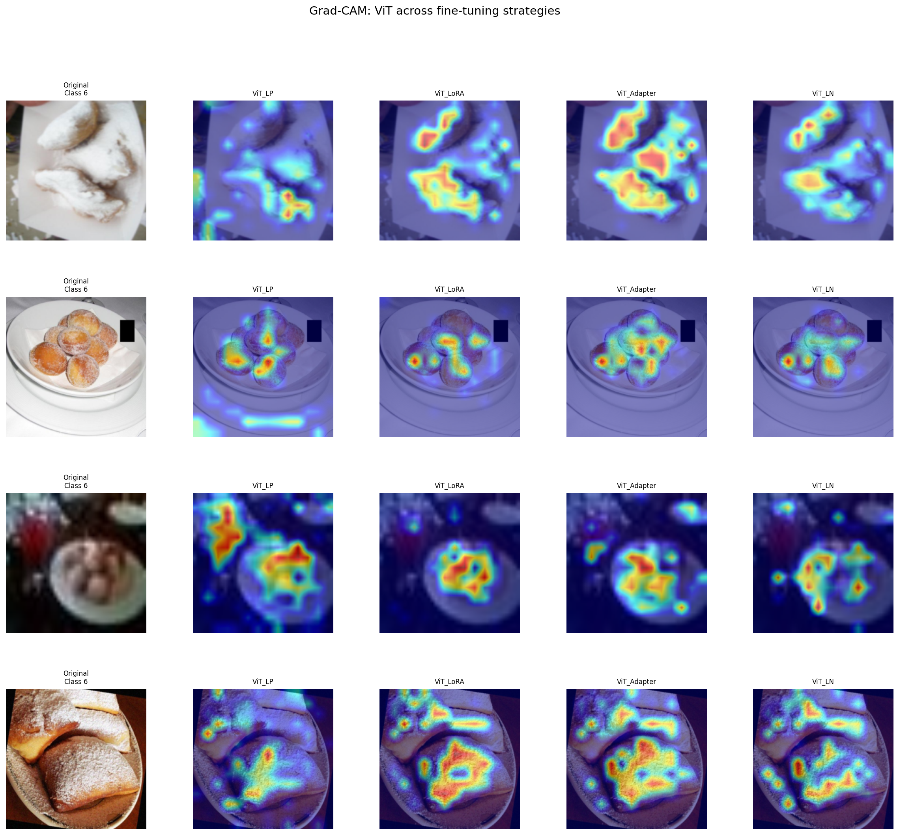

# Food-101 Fine-Tuning Benchmark

A comparative study of parameter-efficient fine-tuning (PEFT) strategies applied to pretrained CNNs and Vision Transformers on the [Food-101](https://huggingface.co/datasets/food101) dataset (101 food categories, 75,750 train / 25,250 test images).

[](https://colab.research.google.com/drive/1ZVFHZFNJq1k4Oru1wIfQlUHQoAjRQKd5?usp=sharing#scrollTo=94Iqb2ZxHarW)

---

## Overview

This project benchmarks four fine-tuning strategies across three backbone architectures:

**Backbones**
- ResNet-18
- EfficientNetV2-S (`tf_efficientnetv2_s`)
- Vision Transformer — ViT-Base/16 (`vit_base_patch16_224`)

**Fine-Tuning Strategies**
- **Linear Probing** — freeze all layers, train the classification head only
- **LoRA** — low-rank adaptation applied to the final linear layer (rank=4, alpha=16)
- **Task-Specific Adapter** — bottleneck adapter (64 units) inserted between the backbone and classifier
- **BatchNorm / LayerNorm Tuning** — freeze all parameters except normalisation layers and the classifier head

Models are trained for 10 epochs (split across two 5-epoch runs with checkpoint resumption) using Adam (lr=1e-3, batch size=64).

---

## Results Summary

### ResNet-18 (10 Epochs)

| Model | Test Acc | FLOPs (G) | Params (K) | Infer (ms/img) |
|---|---|---|---|---|
| ResNet18_BatchNorm | 0.6778 | 3.64 | 61.4 | 0.159 |
| ResNet18_LinearProbe | 0.5196 | 3.64 | 51.8 | 0.167 |
| ResNet18_Adapter | 0.5095 | 3.64 | 117.9 | 0.174 |
| ResNet18_LoRA | 0.1625 | 3.64 | 2.5 | 0.171 |

### EfficientNetV2-S (10 Epochs)

| Model | Test Acc | FLOPs (G) | Params (K) | Infer (ms/img) |
|---|---|---|---|---|
| EffNetV2_BatchNorm | 0.8323 | 5.73 | 283.3 | 0.954 |
| EffNetV2_Adapter | 0.6206 | 5.73 | 294.6 | 1.043 |
| EffNetV2_LinearProbe | 0.6111 | 5.73 | 129.4 | 0.948 |
| EffNetV2_LoRA | 0.1305 | 5.73 | 5.5 | 1.153 |

### ViT-Base/16 (5 Epochs)

| Model | Test Acc | FLOPs (G) | Params (K) | Infer (ms/img) |
|---|---|---|---|---|
| ViT_LayerNorm | 0.8564 | 8.49 | 58.1 | 12.369 |
| ViT_LoRA | 0.8511 | 8.49 | 112.6 | 15.037 |
| ViT_Adapter | 0.8488 | 8.73 | 634.1 | 12.384 |
| ViT_LinearProbe | 0.7737 | 8.49 | 38.9 | 12.710 |

**Key takeaway:** BatchNorm/LayerNorm tuning is the strongest strategy across all three backbones. LoRA consistently underperforms despite its minimal parameter footprint, suggesting low-rank adaptation on the head alone is insufficient for a 101-class task. ViT achieves the highest overall accuracy, but EfficientNetV2-S with BatchNorm tuning is competitive (~83%) at far lower inference cost.

---

## ViT Visualisations

### Training Curves


LayerNorm and LoRA converge quickly and plateau near 85%+ validation accuracy. LinearProbe stalls around 77%, confirming the frozen backbone is a bottleneck for ViT.

### Accuracy vs FLOPs (Bubble = Trainable Params)


LoRA and LayerNorm achieve top accuracy with minimal FLOPs and very few trainable parameters. The Adapter trades a much larger parameter count (634K) for only a marginal accuracy gain.

### Inference Speed vs Accuracy


LayerNorm and Adapter are the fastest at inference (~12.4 ms/img) while matching or exceeding LoRA accuracy. LoRA is notably slower (~15 ms/img) despite its small parameter footprint.

### Grad-CAM: Spatial Attention Across Strategies


All four ViT strategies focus attention on the food item itself rather than background context, suggesting strong feature representations across fine-tuning approaches. LayerNorm and LoRA show tighter, more localised activation.

---

## Evaluation on Corrupted Test Sets

Beyond the standard clean test set, all models are evaluated on six corrupted test splits to measure robustness:

| Split | Description |
|---|---|
| Clean | Original Food-101 validation set |
| Masked | Partial occlusion applied |
| Noise_Rot | Gaussian noise + rotation |
| Blur_Little | Mild Gaussian blur |
| Blur_Medium | Moderate Gaussian blur |
| Downsampled | Low-resolution downsampling |

Metrics reported: test accuracy, FLOPs (GFLOPs), inference time (ms/image), trainable parameter count.

---

## Project Structure

```
Project.ipynb #main notebook (training, evaluation, visualisation)
requirements.txt #python dependencies
plots/  #output visualisations
  ├── vit_training_curves.png
  ├── vit_bubble.png
  ├── vit_infer_vs_acc.png
  ├── vit_gradcam_fixed.png
  └── vit_gradcam.png
test_splits/ #corrupted test sets (required for robustness evaluation)
  ├── clean/
  ├── masked/
  ├── noise_rotation/
  ├── blur_little/
  ├── blur_medium/
  └── downsampled/
*.pth #saved model checkpoints (generated during training)
```

---

## Setup

### Prerequisites

- Python 3.9+
- CUDA GPU recommended (CPU/MPS supported)

### Installation

```bash
pip install -r requirements.txt
```

### Running

Open and run `Project.ipynb` in Jupyter or Google Colab. The notebook is structured into sections:

1. **Setup** — imports, config, seeds
2. **Data** — loads Food-101 from HuggingFace and corrupted test splits from `test_splits/`
3. **Helper Functions** — training loop, evaluation, inference timing, FLOPs calculation
4. **ResNet-18** — four fine-tuning strategies, each with training, checkpoint save/resume, and evaluation
5. **EfficientNetV2-S** — same four strategies applied to a larger backbone
6. **ViT-Base/16** — four PEFT strategies on a Vision Transformer
7. **Analysis** — comparison plots (accuracy vs params, accuracy vs inference time, loss curves)
8. **Grad-CAM** — spatial attention visualisations for ResNet-18 and ViT variants
9. **Evaluation on Corrupted Test Sets** — robustness benchmarking across all six splits

### Google Colab

The notebook was developed on Colab. Click the badge at the top to open it directly. If running locally, update `SAVE_PATH` in the notebook accordingly.

---

## Configuration

Key hyperparameters are defined at the top of the notebook:

```python
NUM_CLASSES = 101
BATCH_SIZE  = 64
NUM_EPOCHS  = 5       # per training run (2 runs = 10 total epochs)
LR          = 1e-3
SEED        = 42
```

---

## Dependencies

See `requirements.txt` for the full list. Core dependencies: `torch`, `torchvision`, `timm`, `datasets` (HuggingFace), `grad-cam`, `calflops`, `loralib`.
